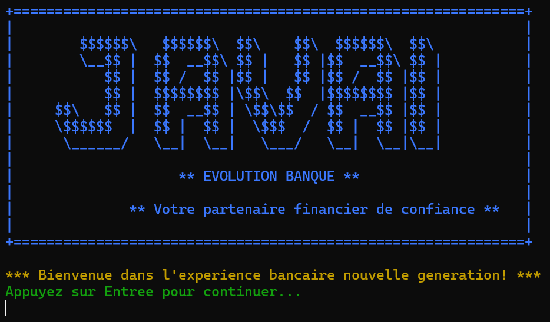
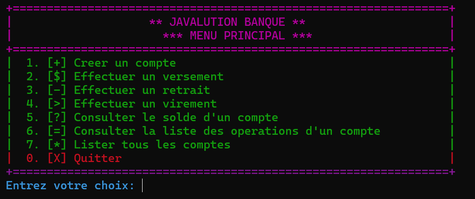
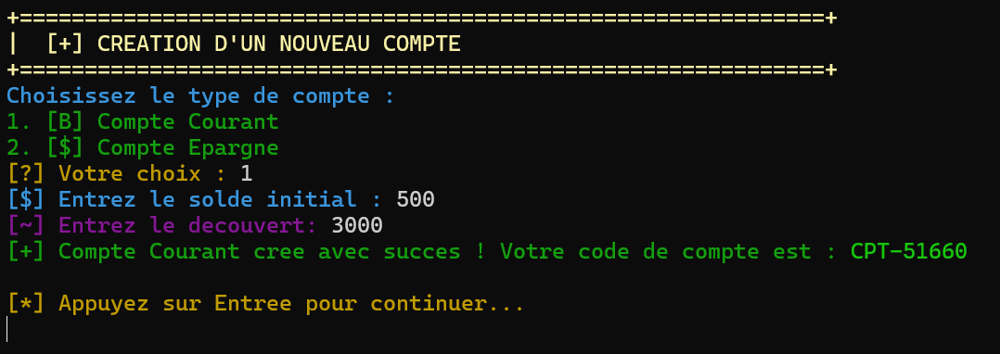
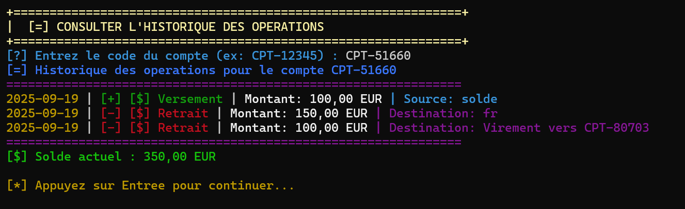
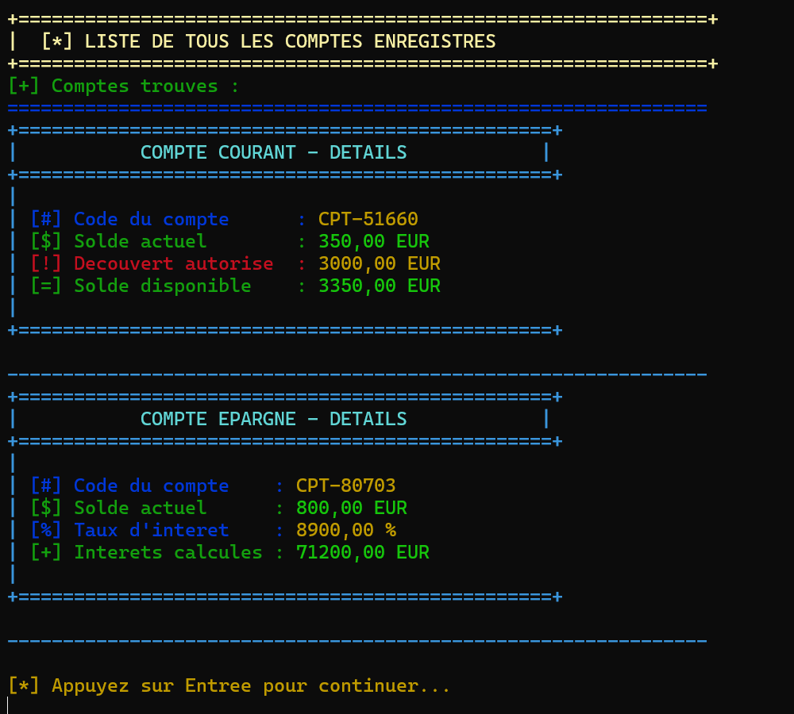

<div align="center">

```
    ╔══════════════════════════════════════════════════════════════════════════════════════╗
    ║                                                                                      ║
    ║      ██╗ █████╗ ██╗   ██╗ █████╗ ██╗     ██╗   ██╗████████╗██╗ ██████╗ ███╗   ██╗    ║
    ║      ██║██╔══██╗██║   ██║██╔══██╗██║     ██║   ██║╚══██╔══╝██║██╔═══██╗████╗  ██║    ║
    ║      ██║███████║██║   ██║███████║██║     ██║   ██║   ██║   ██║██║   ██║██╔██╗ ██║    ║
    ║ ██   ██║██╔══██║╚██╗ ██╔╝██╔══██║██║     ██║   ██║   ██║   ██║██║   ██║██║╚██╗██║    ║
    ║ ╚█████╔╝██║  ██║ ╚████╔╝ ██║  ██║███████╗╚██████╔╝   ██║   ██║╚██████╔╝██║ ╚████║    ║
    ║  ╚════╝ ╚═╝  ╚═╝  ╚═══╝  ╚═╝  ╚═╝╚══════╝ ╚═════╝    ╚═╝   ╚═╝ ╚═════╝ ╚═╝  ╚═══╝    ║
    ║                                                                                      ║
    ║                            🏦 SYSTÈME BANCAIRE CONSOLE 🏦                           ║
    ║                                                                                      ║
    ╚══════════════════════════════════════════════════════════════════════════════════════╝
```


</div>

```
    ┌─────────────────────────────────────────────────────────────────────────────┐
    │                           📋 DESCRIPTION DU PROJET                          
    └─────────────────────────────────────────────────────────────────────────────┘
```

**Javalution Banque** est une application console développée en **Java 8** qui simule la gestion de comptes bancaires. Elle permet de créer des comptes courants (avec gestion de découvert) et des comptes épargne (avec calcul d'intérêts), et d'effectuer des opérations bancaires fondamentales : versements, retraits et virements entre comptes.

L'interface a été conçue pour être claire, intuitive et esthétiquement agréable, en utilisant des couleurs et une mise en page soignée pour guider l'utilisateur.

Ce projet a été réalisé dans le cadre du brief **"Javalution"** pour la formation de **Concepteur Développeur d'Applications**.

```
    ┌─────────────────────────────────────────────────────────────────────────────┐
    │                            🚀 FONCTIONNALITÉS                               
    └─────────────────────────────────────────────────────────────────────────────┘
```

<div align="center">

### 💳 Gestion des Comptes
- ✅ **Compte Courant** - Avec découvert autorisé
- ✅ **Compte Épargne** - Avec calcul d'intérêts
- ✅ **Identifiants uniques** - UUID pour chaque compte

### 💰 Opérations Bancaires
- 📥 **Versements** - Dépôt d'argent sur un compte
- 📤 **Retraits** - Retrait avec vérification des limites
- 🔄 **Virements** - Transfert entre comptes
- 📊 **Historique** - Suivi de toutes les opérations

### 🎨 Interface Utilisateur
- 🌈 **Interface colorée** - Codes couleur ANSI
- 🎯 **Navigation intuitive** - Menu structuré
- 📋 **Affichage détaillé** - Informations complètes des comptes


```
    ┌─────────────────────────────────────────────────────────────────────────────┐
    │                           🛠️ TECHNOLOGIES UTILISÉES                         
    └─────────────────────────────────────────────────────────────────────────────┘
```
<div align="center">

| Technologie | Version | Usage |
|-------------|---------|-------|
| ☕ **Java** | JDK 8 | Langage principal |
| 📅 **Java Time API** | Built-in | Gestion des dates |
| 🆔 **UUID** | Built-in | Identifiants uniques |
| 🔨 **javac & jar** | Built-in | Compilation et packaging |
| 📝 **Git & GitHub** | - | Contrôle de version |
| 📊 **JIRA** | - | Gestion de projet |
</div>
```
    ┌─────────────────────────────────────────────────────────────────────────────┐
    │                            📁 STRUCTURE DU PROJET                           
    └─────────────────────────────────────────────────────────────────────────────┘
```

```
javalution-banque/
├── 📂 src/
│   └── 📂 com/
│       └── 📂 banque/
│           ├── 📂 metier/          #  Couche métier : Logique et règles de gestion
│           │   ├── 📄 Compte.java
│           │   ├── 📄 CompteCourant.java
│           │   ├── 📄 CompteEpargne.java
│           │   └── 📄 Operation.java
│           ├── 📂 ui/              #  Couche présentation : Interface utilisateur
│           │   └── 📄 Menu.java
│           └── 📄 Main.java        #  Point d'entrée de l'application
├── 📂 doc/
│   └── 📄 diagramme-de-classe.png  #  Diagramme de classe UML
├── 📂 screenshots/                 #  Captures d'écran de l'application
├── 📦 JavalutionBanque.jar        #  Fichier JAR exécutable
└── 📖 README.md                   #  Documentation du projet
```

```
    ┌─────────────────────────────────────────────────────────────────────────────┐
    │                              ⚙️ PRÉREQUIS                                   
    └─────────────────────────────────────────────────────────────────────────────┘
```

Pour compiler et exécuter ce projet, vous devez avoir installé :

- ☕ **Java Development Kit (JDK) - Version 8 minimum**

```
    ┌─────────────────────────────────────────────────────────────────────────────┐
    │                         🚀 COMMENT LANCER L'APPLICATION                     
    └─────────────────────────────────────────────────────────────────────────────┘
```

### 🎯 Méthode 1 : Via le fichier JAR (Recommandée)

```bash
# Ouvrez un terminal à la racine du projet et exécutez :
java -jar JavalutionBanque.jar
```

### 🔧 Méthode 2 : Via la compilation manuelle

```bash
# 1. Compiler tous les fichiers .java
javac -d . src/com/banque/**/*.java

# 2. Exécuter l'application
java com.banque.Main
```

```
    ┌─────────────────────────────────────────────────────────────────────────────┐
    │                            📸 CAPTURES D'ÉCRAN                              
    └─────────────────────────────────────────────────────────────────────────────┘
```

### 🏠 Écran d'accueil


### 📋 Menu principal


### 💳 Création d'un compte


### 📊 Historique des opérations


### 📝 Liste de tous les comptes


```
    ┌──────────────────────────────────────────────────────────────────────────────┐
    │                              📋 UTILISATION                                  
    └──────────────────────────────────────────────────────────────────────────────┘
```

1. **🚀 Lancez l'application** avec `java -jar JavalutionBanque.jar`
2. **📋 Naviguez dans le menu** en saisissant le numéro de l'option désirée
3. **💳 Créez vos comptes** (courant ou épargne) selon vos besoins
4. **💰 Effectuez vos opérations** (versements, retraits, virements)
5. **📊 Consultez l'historique** pour suivre toutes vos transactions


</div>
